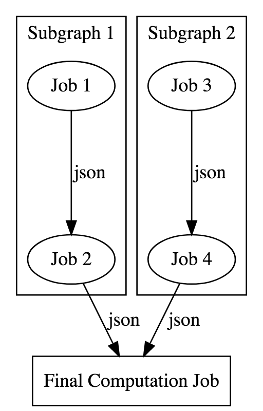

# Cuttle

An embedded job scheduler/executor for your Scala projects.

# Concepts

Embedded means that cuttle is not an hosted service where you submit jobs to schedule/execute. Instead it is
a Scala library that you embed into your own project to schedule and execute a DAG of jobs. The DAG and the jobs
definitions are all written using the cuttle Scala API. The scheduling mechanism can be customized.

## Jobs

A cuttle project is composed of many [Jobs](https://criteo.github.io/cuttle/api/com/criteo/cuttle/Job.html) to execute.

Each job is defined by a set of metadata (_such as the job identifier, name, etc._) and most importantly by a side effect function. This function handles the actual job execution, and its Scala signature is something like `Context => Future[Completed]` (_which can be read as “execute the job for this input parameter and signal me the completion or failure with the returned Future value”_).

The side effect function is opaque for cuttle, so it can't exactly know what will happen there (_it can be any Scala code_), but it assumes that the function:

- Is asynchronous and non-blocking. It will immediately return a [Future](https://www.scala-lang.org/api/current/scala/concurrent/Future.html) value that will be resolved upon execution success or failure.
- Produces a side effect, so calling it actually will do some job and mutate some state somewhere.
- Is idempotent, so calling it twice for the same input (_context_) won't be a problem.

Being idempotent is important because cuttle is an __at least once__ executor. It will ensure that the job has been successfully executed at least once for a given input. In case of failure or crash it may have to execute it again and so it may happen that the side effect function will succeed more that once. It would be very brittle otherwise.

## Scheduler

Executions of these jobs are planned by a [Scheduler](https://criteo.github.io/cuttle/api/com/criteo/cuttle/Scheduler.html). Actually a job is always configured for a specific [Scheduling](https://criteo.github.io/cuttle/api/com/criteo/cuttle/Scheduling.html) and this is the type `S` you usually see in the Scala API. This scheduling information allows to provide more information to the scheduler about how the jobs must be triggered.

The scheduler gets the list of job (a scheduling specific [Workload](https://criteo.github.io/cuttle/api/com/criteo/cuttle/Workload.html)) as input and starts producing [Executions](https://criteo.github.io/cuttle/api/com/criteo/cuttle/Execution.html). A basic scheduler can for example run a single execution for each job.

But of course more sophisticated schedulers can exist. Cuttle comes with a [TimeSeries](https://criteo.github.io/cuttle/api/com/criteo/cuttle/timeseries/TimeSeries.html) scheduler that executes a whole job workflow (a Directed Acyclic Graph of jobs) across time partitions. For example it can execute the graph hourly or daily. And it can even execute it across different time partitions such as a daily job depending on several executions of an hourly job.

The input context given to the side effect function depends of the scheduling. For example the input for a time series job is [TimeSeriesContext](https://criteo.github.io/cuttle/api/com/criteo/cuttle/timeseries/TimeSeriesContext.html) and contains basically the start and end time for the partition for which the job is being executed.

## Executor

The cuttle [Executor](https://criteo.github.io/cuttle/api/com/criteo/cuttle/Executor.html) handles the job executions triggered by the scheduler. When it has to execute a job for a given [SchedulingContext](https://criteo.github.io/cuttle/api/com/criteo/cuttle/SchedulingContext.html) it creates and execution, and then invoke the job's side effect function for it.

As soon as the execution starts, it is in the __Started__ state. Started executions are displayed in the UI with a special status indicating if they are __Running__ or __Waiting__. This actually indicates if the Scala code being currently executed is waiting for some external resources (_the permit to fork an external process for example_). But as soon as the execution is __Started__ it means that the Scala lambda behind is running!

An execution can also be in the __Stuck__ state. It happens when a given execution keeps failing: Let's say the scheduler wants to execute the job _a_ for the _X_ context. So it asks the executor which eventually executes the job side effect. If the function fails, the returned [Future](https://www.scala-lang.org/api/current/scala/concurrent/Future.html) fails and the scheduler is notified of that failure. Because the scheduler really wants that job to be executed for the _X_ context, it will submit it again. When the executor sees this new execution coming back after a failure it will apply a [RetryStrategy](https://criteo.github.io/cuttle/api/com/criteo/cuttle/RetryStrategy.html). The default strategy is to use an exponential backoff to delay the retry of these failing executions. While being in this state __Stuck__ executions are displayed in a special tab of the UI and it means that it is something you should take care of.

An execution can also be in __Paused__ state. It happens when the job itself has been paused. Note that this is a temporary state; eventually the job has to be unpaused and so the executions will be triggered, otherwise more and more paused executions will stack forever.

Finally executions can be __Finished__ either with a __Success__ or __Failed__ state. You can retrieve these old executions in the log for finished executions.

## Execution Platforms

The way to manage external resources in cuttle is via [ExecutionPlatform](https://criteo.github.io/cuttle/api/com/criteo/cuttle/ExecutionPlatform.html). An execution platforms defines the contract about how to use the resources. They are configured at project bootstrap and usually set limits on how resources will be used (_for example to only allow 10 external processes to be forked at the same time_).

This is necessary because potentially thousands of concurrent executions can happen in cuttle. These executions will fight for shared resources via these execution platforms. Usually a platform will use a priority queue to prioritize access to these shared resources, and the priority is based on the [SchedulingContext](https://criteo.github.io/cuttle/api/com/criteo/cuttle/SchedulingContext.html) of each execution (_so the executions with highest priority get access to the shared resources first_). For example the [TimeSeriesContext](https://criteo.github.io/cuttle/api/com/criteo/cuttle/timeseries/TimeSeriesContext.html) defines its [Ordering](https://www.scala-lang.org/api/current/scala/math/Ordering.html) in such way that oldest partitions take priority.

## Flow scheduling 
Flow scheduling is a sub api based on cuttle core API, the goal is to provide a DAG Workflow which use the Core Cuttle `Job`.

To declare a job : 
```scala 
val job1 = Job("job1", FlowScheduling()) { implicit execution => 
    execution.streams.info("Just writing logged info in job execution");
     
    Future.successful(Finished); // Every job finish with a future
}
```
### Simple example

The declaration of the dag is supposed to be simple, let's say we have 5 jobs declared like this code.
```scala
def myWorkflow : FlowWorkflow = ((job1 --> job2) && (job3 --> job4)) --> jobfinal
```
 Flow allow you to compose easily to help you recompose DAG, let's say you have `job1` and `job2` that work together and you want to reuse them in other DAG.
 Then nothing block you to write them elsewhere and reuse them later and build them in subgraph.
 ```scala
 val subgraph1 = job1 --> job2
 val subgraph2 = job3 --> job4
 val finalDag = (subgraph1 && subgraph2) --> jobfinal
 ```


`job1` wil be executed in parallel with `job3` then if both successfully finished then `job2` and `job4` will run.
`jobfinal` will run only if both subgraph are successfully runned. 

### Path
If one of the job fail it will wait before all the current job **Running** to finish and then handle the error by looking for
an **error job** if there is no error job attached to the job **Failing** then it will just fail without recovery.

Error Job are basically normal job just there are attached in a different manner onto the graph.

If we want to attach errors job for the example 01 like this: 


**You have to do this**
```scala
val subgraph1 = job1.error(errorJob1) --> job2.error(errorJob2)
val subgraph2 = job3.error(errorJob3) --> job4.error(errorJob4)
val finalDag : FlowWorkflow = (subgraph1 && subgraph2) --> jobfinal
```
Doing something like this is practical if you want an error management different from one job to another, but if you want
to manage all error job the same way, then nothing block you to do this : 
```scala
val subgraph1 = job1.error(errorJob) --> job2.error(errorJob)
val subgraph2 = job3.error(errorJob) --> job4.error(errorJob)
val finalDag : FlowWorkflow = (subgraph1 && subgraph2) --> jobfinal
```
Looking like 

Flow will rename the error job `job.id` with `${job.id}-from-${parent-job-id}` where *parent-job-id* is the id of 
the job where it comes from, so `errorJob-from-job1`, `errorJob-from-job2` etc.

### Scheduler
The Workflow is backed by a scheduler that will read the DAG and run step by step the workflow. 
You use the workflow by creating a `FlowExecutor` object and running one of its methods `start`, `parStart` or `runSingleJob`.

It is advised to use `FlowManager` and passing the `FlowExecutor` to it, the reasons are : 
1. `FlowManager` use a *Semaphore* to serialize his graph, if you run two workflow based on the same workflow it will avoid both workflow trying to serialize at the same time the same graph.
2. `FlowManager` needs a `SignalManager` (explained after) to run, so if you use a signal system for your graph, it will create before execution and remove after execution the topic to received the signal for this particular **workflow execution**
3.  It can also run a single job based on a **workflow execution id** so if you want to rerun a job from an old execution by providing the FlowWorkflow and others informations.

**Note 1** : If your workflow has failed at one step for whatever reason, you can recall the method `start` 
to rerun the workflow from last step failed. (One example in the test file `FlowTestsSpec.scala`).

**Note 2** : If a job fail because of an exception, then it will just fail the job without triggering the exception, the exception will still be readable in the database execution table.
### Signals 
Flow provide a signal system based on Kafka and Fs2, the class `SignalManager` take a `KafkaConfig` and Key/Value Types matching the 
pattern of Kafka Key/Value topic of Kafka. 

`FlowManager` use `SignalManager[String, _]` to send message to workflow, it uses the Key of the Kafka Topic as *workflow id*
and the value can be anything you want, in our case we have created a simple trait called `EventSignal` that can be used as a value
in those Topic. 

Here you have the only test made for signal in `FlowSignalTestsSpec.scala` 

```scala
    val simpleWorkflow : WFSignalBuilder[String] = topic : SignalManager => {

      lazy val job1 =  Job("step-one", FlowScheduling(inputs = Json.obj("audience" -> "step is one".asJson))) { implicit e =>
        IO(Finished).unsafeToFuture()
      }

      lazy val job1bis = Job("step-one-bis", FlowScheduling()) { implicit execution =>
        execution.streams.info("On step bis")
        val receive = for {
          value <- topic
            .subscribeOnTopic(execution.context.workflowId)
            .evalTap(m => IO(println(s"received $m")))
            .head
            .compile
            .last
        } yield { Output(Json.obj("aud" -> s"step bis is done and received ${value.get._2}".asJson)) }

        receive.unsafeToFuture()
      }

      lazy val job2 = Job("step-two", FlowScheduling(inputs = Json.obj("test" -> "final test".asJson))) { implicit e =>
        val in = e.job.scheduling.inputs
        val x = e.optic.aud.string.getOption(in).get + " passed to step three"
        IO(Output(x.asJson)).unsafeToFuture()
      }

      (job1 && job1bis) --> job2
    }

    val kafkaCf = KafkaConfig("signal_cuttle", "signals", List("localhost:9092"))

    import cats.implicits._
    import scala.concurrent.duration._

    val program = for {
      transactor    <- xa
      stopping      <- Deferred[IO, Unit]
      signalManager <- SignalManager[String, String](kafkaCf)
      scheduler     <- FlowManager(transactor, signalManager)
      workflowWithTopic = simpleWorkflow(signalManager)

      graph1 <- FlowExecutor(transactor, "Run jobs with signal")(workflowWithTopic)
      graph2 <- FlowExecutor(transactor, "Run jobs with signal 2")(workflowWithTopic)

      flow1 <- scheduler.runOne(graph1).start
      flow2 <- scheduler.runOne(graph2).start

      runFlowAndStop = (flow1.join, flow2.join).parMapN { (resWorkflow1, resWorkflow2) =>
        (resWorkflow1, resWorkflow2)
      }.flatMap { res => stopping.complete(()).map(_ => res) }

      finalResult <- (runFlowAndStop,
            signalManager.broadcastTopic.interruptWhen(stopping.get.attempt).compile.drain,
            fs2.Stream.awakeEvery[IO](4 seconds).head.compile.drain *> signalManager.pushOne(graph2.workflowId, "step-one-bis").compile.drain,
            fs2.Stream.awakeEvery[IO](8 seconds).head.compile.drain *> signalManager.pushOne(graph1.workflowId, "step-one-bis").compile.drain)
        .parMapN { (bothWorkflow, _, _, _) => bothWorkflow }
    } yield finalResult

    val bothWorkflow = program.unsafeRunSync()
```
In this quit big example we declared a transcator postgresql, create a `Deferred` to stop the consumer when both workflow are done,
and then create the signal manager based on a config Kafka.

Then we use the type `WFSignalBuilder` which is basically a shortcut for `SignalManager[String, _] => FlowWorkflow`, meaning
you create a workflow based on a Signal Manager. 

We run two workflow based on the same workflow waiting for them to finish, these workflow are waiting for an Event corresponding to their workflow id.
The Event in this case is a String but we don't care what value it is. 

Then at the end we received the two workflow finished which means we receive either a *Left* which will be a **Throwable** or *Right* a tuple **(FlowWorkflow, JobState)**.
The tuple is actually the workflow you give plus all the inputs and outputs of the job, so perfect is you want to
see what happened to a job and the `JobState` which is a map of `FlowJob` and `JobFlowState` corresponding to the state of the job, 
this is useful if you want to see if the job is running, failed or done. 

### Input/Output 


Input and output are managed with Json, in this example, `Job1` might take default input in this case do it like this at the declaration
```scala
val job1 = Job("job1", FlowScheduling(inputs = Json.obj(...))) {...}
```
You can do it with outputs too but it is useless. 
In the job you will be able to access to optic by doing this in the side effect : 
(Exemple I/O)
```scala
val job1 = Job("job1", FlowScheduling(inputs = Json.obj("myvalue" -> "something".asJson))) { implicit e => 
 val myvalue : Option[String] = e.optic.myvalue.string.getOption(e.job.scheduling.inputs)
 // ...
 Future.successful(Output(Json.obj("newval" -> "my new val".asJson)))
}
```
*It is not really convenient to use Json but due to too much problem with Core Cuttle too implement static type then Json as been favoured.*

`Job1` return obviously a Future but with an Output this time, therefore the scheduler will automatically
take the json and put it as an input in the `Job2`, the value `newval` will be available in `Job2`. 

**Note :** in the case of `jobfinal` it will receive both `Job2` and `Job4` outputs but if both of them have common value
it will automatically create a map in the json where the key is the job id and the value corresponding to the value of this particular job. 
If both job return a newval key ``jobfinal`` will receive in his inputs : 
```json 
"newval" : {
    "job2" : "value_in_job2",
    "job4" : "value_in_job4"
}
```
**Note 2** : The key are formatted following the rules in the file `FlowSchedulerUtils.scala`

**Note 3** : If you want to trigger an error job but still want him to send data then you can use `OutputErr(data : io.circe.Json)`

Possible `Future[Completed]` for the job are : 
- `Finished` : Is like `Unit`, a success but nothing to return
- `Output(data : io.circe.Json)` : Return a json and successfully finish the job
- `OutputErr(data : io.circe.Json)` : Fail the job and return json
- `Fail` : Just fail the job


###Examples
See the folder `examples` or `tests` in `flow` module for more example.
# Documentation

The [API documentation](https://criteo.github.io/cuttle/api/index.html) is the main reference for Scala programmers.

For a project example, you can also follow these hands-on introductions:
- [A basic project using the built-in timeseries scheduler](https://criteo.github.io/cuttle/examples/examples0/HelloTimeSeries.scala.html).
- [A minimal custom scheduling](https://criteo.github.io/cuttle/examples/examples0/HelloCustomScheduling.scala.html)

To run the example application, checkout the repository, launch the [sbt](http://www.scala-sbt.org/) console in the project (_you will need [yarn](https://yarnpkg.com/en/) as well to compile the UI part_), and run the `example HelloWorld` command.

# Usage

The library is cross-built for __Scala 2.11__ and __Scala 2.12__.

The core module to use is `"com.criteo.cuttle" %% "cuttle" % "0.9.2"`.

You also need to fetch one __Scheduler__ implementation:
- __Flow__: `"com.criteo.cuttle" %% "flow" % "0.9.2""`.
- __Cron__: `"com.criteo.cuttle" %% "cron" % "0.9.2""`.

# License

This project is licensed under the Apache 2.0 license.

# Copyright

Copyright © Criteo, 2019.
